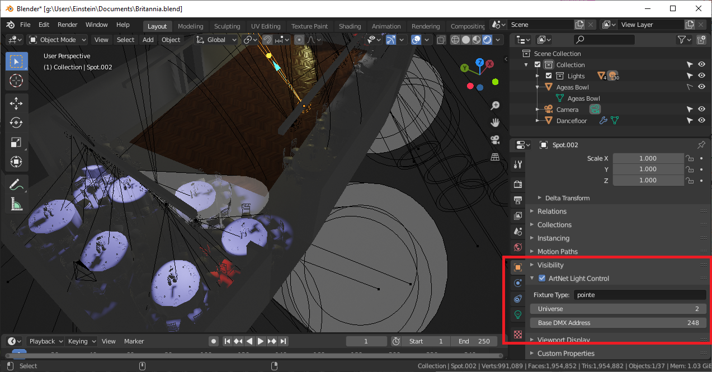

# blender-artnet
Blender script to push ArtNet data to Evee lights. Runs at 30fps with Evee rendering in the viewport.

Combine with QLCPlus to have a fully open source lighting system

# Install

Clone this repo and remember the folder where you put it

1. Install Blender 2.8 or higher.
2. `Edit | Preferences` menu opens the preferences dialog
3. Select the `Add-ons` tab
4. Press the `Install...` button
5. Select the `__init__.py` file in the folder you cloned into
6. Press the `Install Addon` button
7. Close the preferences dialog
8. ...
9. Profit!

# Usage

Turn on Viewport Shading and Evee rendering

Select a light in your scene and enable ArtNet Light Control in the properties. Assign a universe, base 
address and fixture type

Add your own named fixture types in `src/fixture_type_store.py`

# Support

## Version 1.3:

Supports Area light type in Blender
Hides artnet panel for unsupported lights

## Version 1.2:

Supports Spot light type in Blender

Handles the following DMX channels (coarse only for now)
* RGBW (additive)
  * red
  * green
  * blue
  * white
* CMY (subtractive)
  * cyan
  * magenta
  * yellow
* Colour wheels
  * currently continuously varying wheels are not supported
* dimmer
* zoom (invertable for some fixtures)
* Movement
  * pan
  * tilt

# Future ideas

Focus can be handled by changing the spot size in Blender

Frost can be handled by changing the spot blend radius in Blender

Gobos can be handled by [https://www.youtube.com/watch?v=Af-yLsRpF7I]

# Contributions wanted
* Let's work out how to get fixture definitions in from an open source store
* Work out how to map light lux levels to Blender light power

Please submit a PR if you have an improvement.
